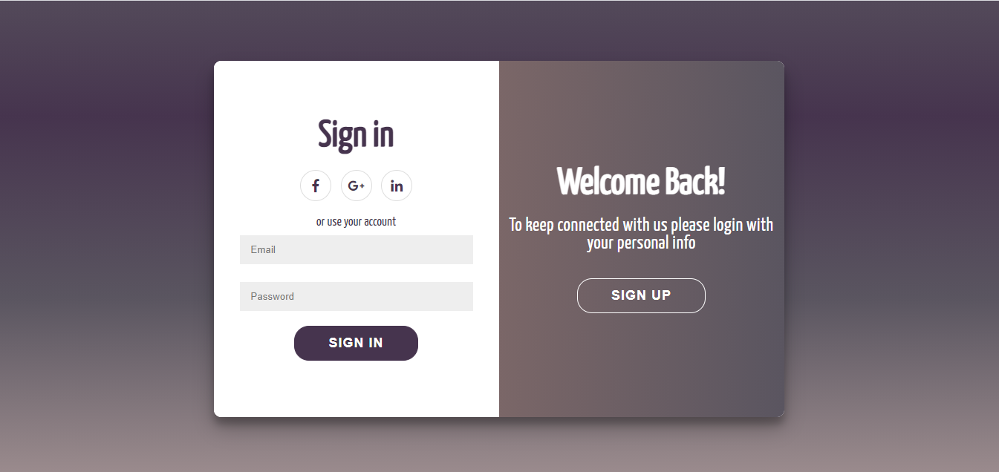
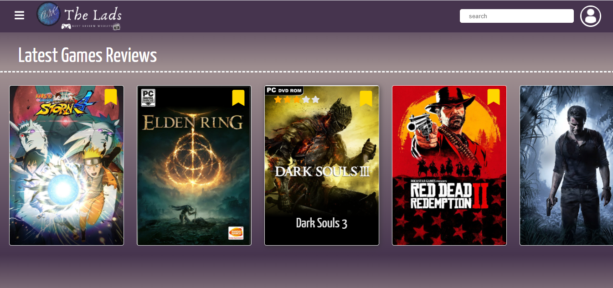
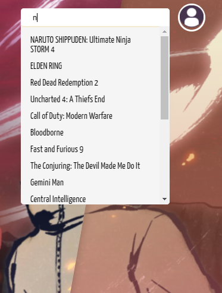
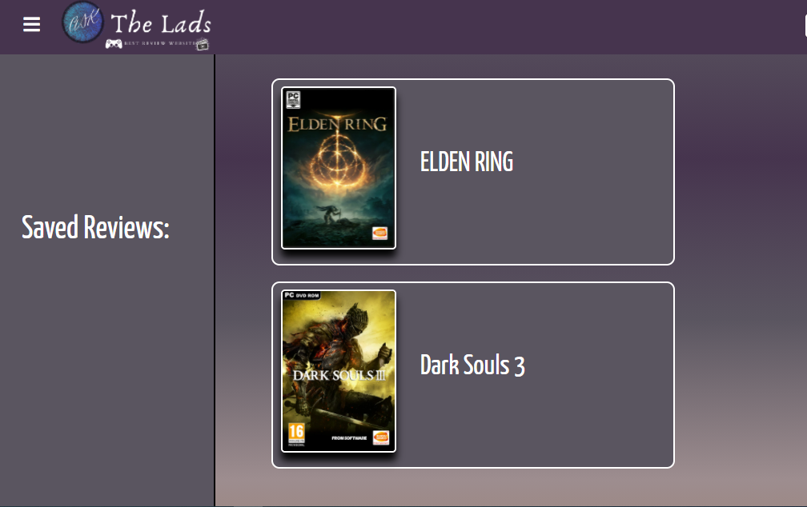
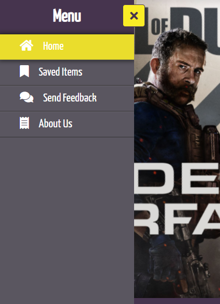

1-
|Name|Link
|-----|-----
|	sign up page|
|	The home page and review items |
|	A search feature |
|	A page to show the saved reviews |
|	The side menu |
|	The about us and content us page |.png)

 ## Risks and how i solved it :
 + Too many decision makers (stakeholders, committees) :
 
 We made certain that project managers/representatives had enough authority and assistance to make choices. 
	
+ Underestimation of the time :

we made sure that we dont need to waste any time 
	
 
## my website strength and weakness :
weakness: 

+ my website has onlt a local storage (not a real database)
+ it doesnt have a server 

strength : 

+ the website can publish when the database is ready
+ it have a good design and it is dynamic 

